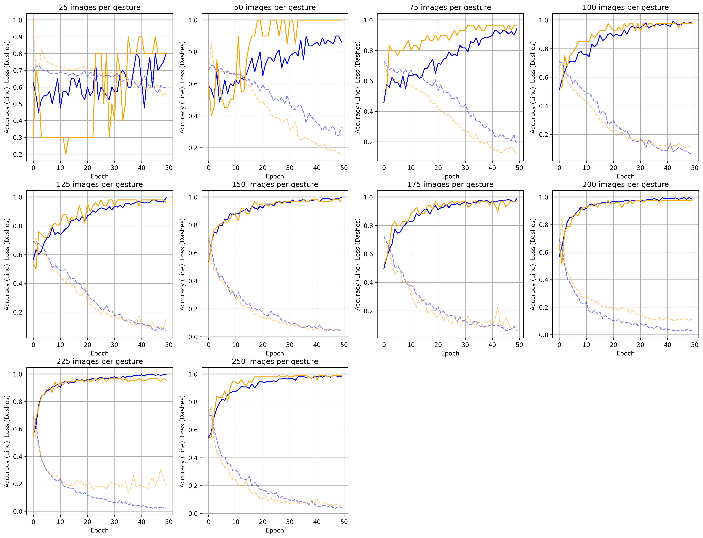
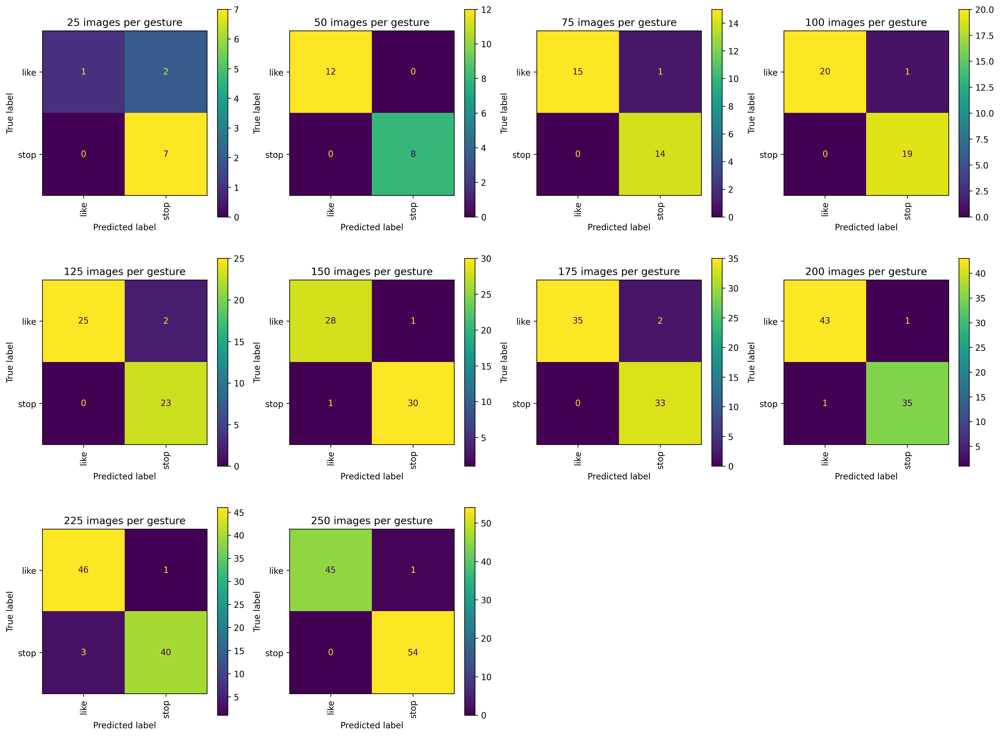
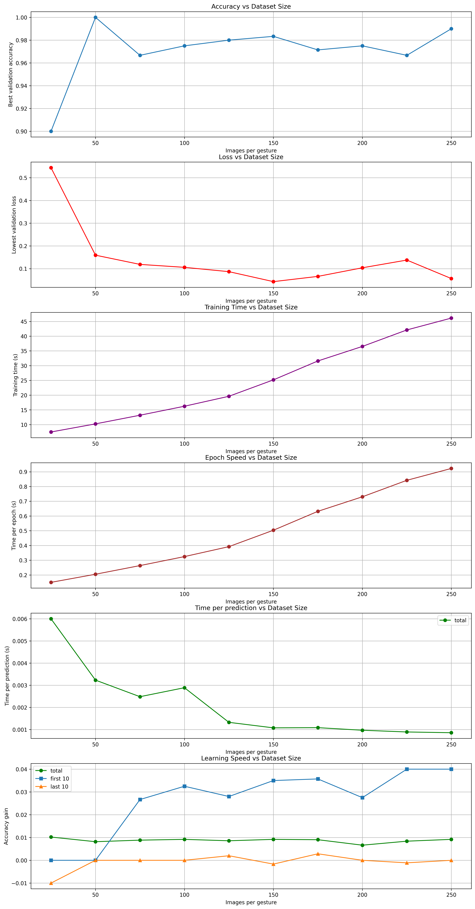

# Results
## Subset with 25 images per gesture
- Total images: 50
- Train images: 40
- Test images: 10
- Total training time: 7.489
- Total prediciton time: 0.005997610092163086
- Average training time per epoch: 0.14978s
- max val_accuracy: 0.8999999761581421
- min val_loss: 0.5439344048500061
- Average val_accuracy gain over all epochs: 0.01020408163265306
- Average val_accuracy gain in the first 10 epochs: 0.0
- Average val_accuracy gain in the last 10 epochs: -0.009999996423721314
## Subset with 50 images per gesture
- Total images: 100
- Train images: 80
- Test images: 20
- Total training time: 10.242
- Total prediciton time: 0.003229570388793945
- Average training time per epoch: 0.20484000000000002s
- max val_accuracy: 1.0
- min val_loss: 0.1592622548341751
- Average val_accuracy gain over all epochs: 0.00816326481955392
- Average val_accuracy gain in the first 10 epochs: 0.0
- Average val_accuracy gain in the last 10 epochs: 0.0
## Subset with 75 images per gesture
- Total images: 150
- Train images: 120
- Test images: 30
- Total training time: 13.176
- Total prediciton time: 0.002481691042582194
- Average training time per epoch: 0.26352s
- max val_accuracy: 0.9666666388511658
- min val_loss: 0.11869347840547562
- Average val_accuracy gain over all epochs: 0.00884353627963942
- Average val_accuracy gain in the first 10 epochs: 0.026666665077209474
- Average val_accuracy gain in the last 10 epochs: 0.0
## Subset with 100 images per gesture
- Total images: 200
- Train images: 160
- Test images: 40
- Total training time: 16.227
- Total prediciton time: 0.0028874337673187255
- Average training time per epoch: 0.32454s
- max val_accuracy: 0.9750000238418579
- min val_loss: 0.10574525594711304
- Average val_accuracy gain over all epochs: 0.009183674442524813
- Average val_accuracy gain in the first 10 epochs: 0.03250000476837158
- Average val_accuracy gain in the last 10 epochs: 0.0
## Subset with 125 images per gesture
- Total images: 250
- Train images: 200
- Test images: 50
- Total training time: 19.605
- Total prediciton time: 0.0013241291046142579
- Average training time per epoch: 0.3921s
- max val_accuracy: 0.9800000190734863
- min val_loss: 0.08677289634943008
- Average val_accuracy gain over all epochs: 0.008571427695605219
- Average val_accuracy gain in the first 10 epochs: 0.02799999713897705
- Average val_accuracy gain in the last 10 epochs: 0.0019999980926513673
## Subset with 150 images per gesture
- Total images: 300
- Train images: 240
- Test images: 60
- Total training time: 25.17
- Total prediciton time: 0.0010755260785420735
- Average training time per epoch: 0.5034000000000001s
- max val_accuracy: 0.9833333492279053
- min val_loss: 0.042875584214925766
- Average val_accuracy gain over all epochs: 0.00918367322610349
- Average val_accuracy gain in the first 10 epochs: 0.03500000238418579
- Average val_accuracy gain in the last 10 epochs: -0.0016666710376739501
## Subset with 175 images per gesture
- Total images: 350
- Train images: 280
- Test images: 70
- Total training time: 31.584
- Total prediciton time: 0.001084228924342564
- Average training time per epoch: 0.63168s
- max val_accuracy: 0.9714285731315613
- min val_loss: 0.06592731177806854
- Average val_accuracy gain over all epochs: 0.009037900944145359
- Average val_accuracy gain in the first 10 epochs: 0.03571428656578064
- Average val_accuracy gain in the last 10 epochs: 0.002857142686843872
## Subset with 200 images per gesture
- Total images: 400
- Train images: 320
- Test images: 80
- Total training time: 36.517
- Total prediciton time: 0.0009677320718765259
- Average training time per epoch: 0.7303400000000001s
- max val_accuracy: 0.9750000238418579
- min val_loss: 0.10378648340702057
- Average val_accuracy gain over all epochs: 0.0066326540343615474
- Average val_accuracy gain in the first 10 epochs: 0.027500003576278687
- Average val_accuracy gain in the last 10 epochs: 0.0
## Subset with 225 images per gesture
- Total images: 450
- Train images: 360
- Test images: 90
- Total training time: 42.108
- Total prediciton time: 0.0008895609113905165
- Average training time per epoch: 0.8421599999999999s
- max val_accuracy: 0.9666666388511658
- min val_loss: 0.13775575160980225
- Average val_accuracy gain over all epochs: 0.008390022783863301
- Average val_accuracy gain in the first 10 epochs: 0.03999999761581421
- Average val_accuracy gain in the last 10 epochs: -0.0011111080646514892
## Subset with 250 images per gesture
- Total images: 500
- Train images: 400
- Test images: 100
- Total training time: 46.133
- Total prediciton time: 0.0008558297157287598
- Average training time per epoch: 0.92266s
- max val_accuracy: 0.9900000095367432
- min val_loss: 0.05646033585071564
- Average val_accuracy gain over all epochs: 0.00918367322610349
- Average val_accuracy gain in the first 10 epochs: 0.03999999761581421
- Average val_accuracy gain in the last 10 epochs: 0.0

## val_accuracy and val_loss over epochs for all models

- The accuracy and loss plots show that models trained on a higher number of images reach a higher accuracy and lower loss in less epochs.
- It is hard to interpret the plots for the models < 100 images per gesture because the sample is very low which results in a lot of random noise in the plots. However it looks like the accuracy increases almost linearly until 50 epochs are reached. But the other model trained with >= 200 images per gesture show a really sharp increase in the first 10 epochs and then a slower increase until about the 20th epoch. After that the accuracy barely increases. This also matches the results above (average val_accuracy gain in the first 10 epochs,a verage val_accuracy gain in the last 10 epochs)
- It is surprsing that the average val_accuracy gains over all epochs show that a certain maximum for the increase is already, nearly reached at already 100 images per gesture (160 in training). Also 50 and 75 images per gesture are already quite close to this maximum compared to 25 images per gesture.
- The decrease of loss and the minimum loss show the the same pattern (inverted).

## confusion matrices for all models

- The confusion matrices show the same pattern as the loss and accuracy plots. For 25 the performance is poor (also due to very few predictions), but for all other models the predictions are quite good (after 50 epochs).

## Comparison of models

- The comparison of accuracies shows the same pattern as described before. Surprisingly the peak is at 50 images per gesture which is probably not reliable and just the result of randomness. 
Excluding this the real peak is with 250 images per gesture (400 training images) and the maximum accuracy increases with the growing number of training images. However the increase between the different steps is quite small (except for 25 images per gesture). 
- The comparison of loss values isn't any different here.
- Total training time and time per epoch show a linear increase in time with the increase of number of training images. This makes sense because the number of training images also increase linearly and the models simply perform the same computations more often (proportionnaly to the input training data) during training.
- The plot of the time per prediction surprisingly shows that a higher number of trainings images results in a shorter time per prediction. I cannot explain this. It might a result of the increase of the size of the test data sets if the predict function has a longer setup or cleanup part. The time difference is also really small. 
- The last plot shows that the gained accuracy in the first 10 epochs is higher with more training images, while it is similar over all epochs and in the last 10 epochs. It is surprising that the last 10 epochs with 25 images per gesture on average have a negative impact on (validation) accuracy. This is a sign of overfitting. Consequently we can assume that there was to much training here for this small training data set.